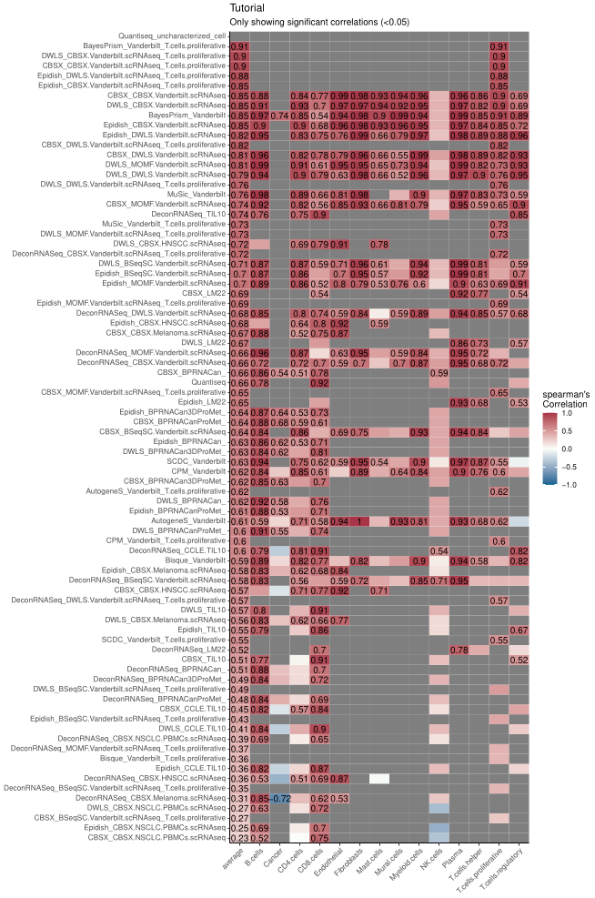

```{r, include = FALSE}
knitr::opts_chunk$set(
  collapse = TRUE,
  comment = "#>"
)
```

This tutorial demonstrates how to use the `multideconv` package and explains the main functions of the pipeline for deconvolving RNA-seq data.

```{r setup}
library(multideconv)
```

## **Deconvolution with default methods**

The basic function is to perform cell type deconvolution using six default methods (`quanTIseq`, `DeconRNASeq`, `CIBERSORTx`, `EpiDISH`, `DWLS`, `MOMF`) and nine default signatures (see paper [Hurtado et al., 2025](https://www.biorxiv.org/content/10.1101/2025.04.29.651220v2.article-info)). The function accepts either raw counts or TPM-normalized counts as input (with genes as SYMBOL).

**NOTE:** If you plan to use `CIBERSORTx`, you must provide your credentials (see README for details). The resulting deconvolution matrix is automatically saved in the `Results/` directory.

The output includes all combinations of deconvolution features, method-signature-cell type.

```{r, eval = FALSE}
bulk = multideconv::raw_counts
deconv = compute.deconvolution(raw.counts = bulk, 
                               methods = c("Quantiseq", "Epidish", 
                                           "DeconRNASeq", "DWLS","MOMF"), 
                               normalized = TRUE, 
                               return = TRUE, 
                               file_name = "Tutorial")
```

To exclude specific methods or signatures, use the methods or signatures_exclude arguments:

```{r, eval = FALSE}
deconv = compute.deconvolution(raw.counts = bulk, 
                               methods = c("Quantiseq", "DeconRNASeq"), 
                               normalized = TRUE,
                               signatures_exclude = "BPRNACan", 
                               return = TRUE, 
                               file_name = "Tutorial")
```

To speed up computation, `multideconv` supports parallelization. Set `doParallel = TRUE` and specify the number of workers based on your system's resources:

```{r, eval = FALSE}
deconv = compute.deconvolution(raw.counts = bulk, 
                               methods = "DWLS", 
                               normalized = TRUE, 
                               return = TRUE, 
                               file_name = "Tutorial", 
                               doParallel = TRUE, 
                               workers = 3)
```

## **Cell type signatures**

In order to access the default signatures `multideconv` provides, you can do the following:

To list all signatures

```{r}
path <- system.file("signatures/", package = "multideconv")
list.files(path)
```

To access a specific signature

```{r}
signature = read.delim(paste0(path, "CBSX-Melanoma-scRNAseq.txt"))
head(signature)
```

## **Single-cell metacell construction**

If single-cell data is available, we recommend generating metacells to reduce computation time and prevent session crashes. Deconvolution methods that rely on single-cell data can be computationally intensive, especially with large matrices. We suggest using a maximum of 20k cells; if your object exceeds this size, creating metacells is strongly advised. However, if your computational resources are sufficient to handle the full single-cell dataset, you may skip this step.

We adapted functions from the R package hdWGCNA (@morabito2023hdwgcna; @langfelder2008wgcna) for the construction of metacells using the KNN algorithm.

-   **sc_object**: Normalized gene expression matrix with genes as rows and cells as columns

-   **labels_column**: Vector of cell annotations

-   **samples_column**: Vector of sample IDs for each cell

-   **exclude_cells**: Vector specifying which cell types to ignore during metacell construction (default is NULL)

-   **min_cells**: Minimum number of cells required to construct metacells in a group

-   **k**: Number of nearest neighbors used for the KNN algorithm

-   **max_shared**: Maximum number of cells shared between two metacells

-   **n_workers**: Number of cores to use for parallelizing metacell construction

-   **min_meta**: Minimum number of metacells required for a cell type to be retained

Because of space limitations, we have not included a complete single-cell object in this tutorial. However, users are expected to provide their own single-cell data and supply it to the `sc_object` parameter in the function call.
```{r, eval=FALSE}
metacells = create_metacells(sc_object, 
                             labels_column = cell_labels, 
                             samples_column = sample_labels, 
                             exclude_cells = NULL,
                             min_cells = 50, 
                             k = 15, 
                             max_shared = 15, 
                             n_workers = 4, 
                             min_meta = 10)
```

## **Second-generation deconvolution methods**

Once the single-cell data is prepared, users can supplement the default deconvolution methods with second-generation approaches such as `AutogeneS`, `BayesPrism`, `Bisque`, `CPM`, `MuSic`, and `SCDC`. These methods learn cell-type signatures directly from annotated single-cell RNA-seq data, rather than relying on predefined static signatures (@Dietrich2024.06.10.598226), to deconvolve bulk RNA-seq profiles.

-   **sc_deconv**: Boolean indicating whether to run second-generation methods

-   **sc_matrix**: Normalized single-cell gene expression matrix

-   **sc_metadata**: Dataframe containing single-cell metadata

-   **cell_annotations**: Vector of cell type labels

-   **cell_samples**: Vector of sample IDs

-   **name_sc_signature**: Name to assign to the resulting signature

```{r}
metacell_obj = multideconv::metacells_data
metacell_metadata = multideconv::metacells_metadata
head(metacell_obj[1:5,1:5])
head(metacell_metadata)
```

This function computes cell type deconvolution using the six default methods (`quanTIseq`, `DeconRNASeq`, `EpiDISH`, `DWLS`, `MOMF`) and `CIBERSORTx` (if credentials are provided), along with second-generation deconvolution approaches. The output includes all combinations of methods and signatures.

```{r, eval=FALSE}
deconv = compute.deconvolution(raw.counts = bulk, 
                               normalized = TRUE, 
                               return = TRUE, 
                               methods = c("Quantiseq", "Epidish", "DeconRNASeq"),
                               file_name = "Tutorial", 
                               sc_deconv = TRUE, 
                               sc_matrix = metacell_obj, 
                               sc_metadata = metacell_metadata, 
                               methods_sc = c("Autogenes", "BayesPrism", 
                                              "Bisque", "CPM", "MuSic", "SCDC"),
                               cell_label = "annotated_ct", 
                               sample_label = "sample", 
                               name_sc_signature = "Test")
```

To run only the second-generation deconvolution methods based on single-cell data, without using any static cell-type signatures, use the following:

```{r, eval=FALSE}
deconv_sc = compute_sc_deconvolution_methods(raw_counts = bulk, 
                                             normalized = TRUE, 
                                             methods_sc = c("Autogenes", "BayesPrism", 
                                                            "Bisque", "CPM", "MuSic", "SCDC"),
                                             sc_object = metacell_obj, 
                                             sc_metadata = metacell_metadata, 
                                             cell_annotations = "annotated_ct", 
                                             samples_ids = "sample", 
                                             name_object = "Test", 
                                             n_cores = 2, 
                                             return = TRUE, 
                                             file_name = "Tutorial")
```

## **Pseudo-bulk profiles**

To create pseudo-bulk profiles from the original single-cell objects, simulating a bulk RNA-seq dataset, you can use the following function:

**NOTE:** You can input either your original single-cell object or the metacell object. Just be sure to select the same object when examining the real cell proportions (if needed).

```{r}
metacells_seurat = Seurat::CreateSeuratObject(metacell_obj, meta.data = metacell_metadata)
pseudobulk = create_sc_pseudobulk(metacells_seurat, cells_labels = "annotated_ct", sample_labels = "sample", normalized = TRUE, file_name = "Tutorial")
```

## **Creating cell type signatures**

To create cell type signatures, `multideconv` uses four methods: `CIBERSORTx`, `DWLS`, `MOMF`, and `BSeq-SC`. You must provide single-cell data as input. Signatures are saved in the `Results/custom_signatures` directory, and returned as a list. From now and after `compute.deconvolution()` will use these signatures additionally to the default ones! So if you would like to have the deconvolution results based on your new files, make sure to run `compute.deconvolution()`

To run `BSeq-SC`, supply the `cell_markers` argument, which should contain the differential markers for each cell type (these can be obtained using `FindMarkers()` or `FindAllMarkers()` from Seurat).

```{r, eval=FALSE}
bulk_pseudo = multideconv::pseudobulk
signatures = create_sc_signatures(metacell_obj, 
                                  metacell_metadata, 
                                  cells_labels = "annotated_ct", 
                                  sample_labels = "sample", 
                                  bulk_rna = bulk_pseudo, 
                                  cell_markers = NULL, 
                                  name_signature = "Test",
                                  methods_sig = c("DWLS", "CIBERSORTx", "MOMF", "BSeqsc"))
```

## **Cell types signatures benchmark**

To validate the generated signatures, we provide a benchmarking function to compare deconvolution outputs against known cell proportions (e.g., from single-cell or imaging data). The `cells_extra` argument should include any non-standard cell types present in your ground truth. Make sure cell names match those in the deconvolution matrix (e.g., use B.cells instead of B cells if that is the naming convention used - see README for more information).

```{r}
deconv_pseudo = multideconv::deconvolution
cells_groundtruth = multideconv::cells_groundtruth
benchmark = compute.benchmark(deconv_pseudo, 
                              cells_groundtruth, 
                              cells_extra = c("Mural.cells", "Myeloid.cells"), 
                              corr_type = "spearman",
                              scatter = FALSE, 
                              plot = TRUE, 
                              pval = 0.05, 
                              file_name = "Tutorial", 
                              width = 10, 
                              height = 15)
```

```{r hdwgcna-figure, echo=FALSE, fig.align='center', out.width='70%'}

```

::: {style="text-align: center;"}
<em>Figure 1. Example of performance of different methods and signature combinations on the pseudo bulk.</em>
:::

## **Cell type processing**

Deconvolution analysis reduces the dimensionality and heterogeneity of the deconvolution results. It uses the cell type processing algorithm described in the paper [Hurtado et al., 2025](https://www.biorxiv.org/content/10.1101/2025.04.29.651220v2.article-info). It returns the cell type subgroups composition and the reduced deconvolution matrix, saved in the `Results/` directory.

-   **deconvolution**: Matrix of raw deconvolution results (output of `compute.deconvolution()`)

-   **corr**: Minimum correlation threshold to group features

-   **seed**: Random seed for reproducibility

-   **return**: Whether to return results and save output files to the `Results/` directory

```{r, message=FALSE}
deconv_bulk = multideconv::deconv_bulk
deconv_subgroups = compute.deconvolution.analysis(deconvolution = deconv_bulk, 
                                                  corr = 0.7, 
                                                  seed = 123, 
                                                  file_name = "Tutorial", 
                                                  return = TRUE) 
```

Subgroups composition can be extracted with:

```{r}
deconv_subgroups[[3]]$B.cells
deconv_subgroups[[3]]$Macrophages.M2
deconv_subgroups[[3]]$Dendritic.cells
```

Reduced deconvolution matrix:

```{r}
head(subgroups[[1]][,sample(colnames(subgroups[[1]]), 10)])
```

If your deconvolution matrix contains non-standard cell types (see README), specify them using `cells_extra` to ensure proper subgrouping. If not, they are going to be discarded automatically.

```{r, eval = FALSE}
deconv_subgroups = compute.deconvolution.analysis(deconvolution = deconv_pseudo, 
                                                  corr = 0.7, 
                                                  seed = 123, 
                                                  return = TRUE,
                                                  cells_extra = c("Mural.cells", "Myeloid.cells"), 
                                                  file_name = "Tutorial") 
```

## **Replicate deconvolution subgroups in an independent set**

Cell subgroup identification through deconvolution is cohort-specific, as it relies on correlation patterns across samples. This means that subgroup definitions may vary across different splits or datasets. If you aim to replicate the same subgroups identified in one dataset onto another (e.g., for model validation), you can use the following function.

The function below reconstructs and applies the subgroup signatures derived from a previous deconvolution, making it especially useful when transferring learned patterns across datasets—such as when training and evaluating machine learning models. 
```{r}
deconv_1 = deconv_bulk[1:100,]
deconv_2 = deconv_bulk[101:192,]

deconv_subgroups = compute.deconvolution.analysis(deconvolution = deconv_1, 
                                                  corr = 0.7, 
                                                  seed = 123, 
                                                  file_name = "Tutorial", 
                                                  return = FALSE) 

deconv_subgroups_replicate = replicate_deconvolution_subgroups(deconv_subgroups, deconv_2)
```

**NOTE:** `multideconv` is built on top of existing frameworks and makes extensive use of the R packages `immunedeconv` (@10.1093/bioinformatics/btz363) and `omnideconv` (@Dietrich2024.06.10.598226). If you use `multideconv` in your work, please cite our package along with these foundational packages. We also encourage you to cite the individual deconvolution algorithms you employ in your analysis.

| method | license | citation |
|-----------------|-----------------|---------------------------------------|
| [quanTIseq](http://icbi.at/software/quantiseq/doc/index.html) | free ([BSD](https://github.com/omnideconv/immunedeconv/blob/master/LICENSE.md)) | Finotello, F., Mayer, C., Plattner, C., Laschober, G., Rieder, D., Hackl, H., ..., Sopper, S. (2019). Molecular and pharmacological modulators of the tumor immune contexture revealed by deconvolution of RNA-seq data. Genome medicine, 11(1), 34. <https://doi.org/10.1186/s13073-019-0638-6> |
| [EpiDISH](https://github.com/sjczheng/EpiDISH) | free ([GPL 2.0](https://github.com/sjczheng/EpiDISH/blob/devel/DESCRIPTION)) | Zheng SC, Breeze CE, Beck S, Teschendorff AE (2018). “Identification of differentially methylated cell-types in Epigenome-Wide Association Studies.” Nature Methods, 15(12), 1059. <https://doi.org/10.1038/s41592-018-0213-x> |
| [DeconRNASeq](https://git.bioconductor.org/packages/DeconRNASeq) | free ([GPL-2](https://www.bioconductor.org/packages/release/bioc/html/DeconRNASeq.html)) | [joseph.szustakowski\@novartis.com](mailto:joseph.szustakowski@novartis.com){.email} TGJDS (2025). DeconRNASeq: Deconvolution of Heterogeneous Tissue Samples for mRNA-Seq data. <doi:10.18129/B9.bioc.DeconRNASeq>, R package version 1.50.0, <https://bioconductor.org/packages/DeconRNASeq> |
| [AutoGeneS](https://github.com/theislab/AutoGeneS/) | free ([MIT](https://github.com/theislab/AutoGeneS/blob/master/LICENSE)) | Aliee, H., & Theis, F. (2021). AutoGeneS: Automatic gene selection using multi-objective optimization for RNA-seq deconvolution. <https://doi.org/10.1101/2020.02.21.940650> |
| [BayesPrism](https://github.com/Danko-Lab/BayesPrism) | free ([GPL 3.0](https://github.com/Danko-Lab/BayesPrism/blob/main/BayesPrism/DESCRIPTION)) | Chu, T., Wang, Z., Pe’er, D. et al. Cell type and gene expression deconvolution with BayesPrism enables Bayesian integrative analysis across bulk and single-cell RNA sequencing in oncology. Nat Cancer 3, 505–517 (2022). <https://doi.org/10.1038/s43018-022-00356-3> |
| [Bisque](https://github.com/cozygene/bisque) | free ([GPL 3.0](https://github.com/cozygene/bisque/blob/master/DESCRIPTION)) | Jew, B., Alvarez, M., Rahmani, E., Miao, Z., Ko, A., Garske, K. M., Sul, J. H., Pietiläinen, K. H., Pajukanta, P., & Halperin, E. (2020). Publisher Correction: Accurate estimation of cell composition in bulk expression through robust integration of single-cell information. Nature Communications, 11(1), 2891. <https://doi.org/10.1038/s41467-020-16607-9> |
| [BSeq-sc](https://github.com/shenorrLab/bseqsc) | free ([GPL 2.0](https://github.com/shenorrLab/bseqsc/blob/master/DESCRIPTION)) | Baron, M., Veres, A., Wolock, S. L., Faust, A. L., Gaujoux, R., Vetere, A., Ryu, J. H., Wagner, B. K., Shen-Orr, S. S., Klein, A. M., Melton, D. A., & Yanai, I. (2016). A Single-Cell Transcriptomic Map of the Human and Mouse Pancreas Reveals Inter- and Intra-cell Population Structure. In Cell Systems (Vol. 3, Issue 4, pp. 346–360.e4). <https://doi.org/10.1016/j.cels.2016.08.011> |
| [CIBERSORTx](https://cibersortx.stanford.edu/) | free for non-commerical use only | Newman, A. M., Liu, C. L., Green, M. R., Gentles, A. J., Feng, W., Xu, Y., Hoang, C. D., Diehn, M., & Alizadeh, A. A. (2015). Robust enumeration of cell subsets from tissue expression profiles. Nature Methods, 12(5), 453–457. <https://doi.org/10.1038/s41587-019-0114-2> |
| [CPM](https://github.com/amitfrish/scBio) | free ([GPL 2.0](https://github.com/amitfrish/scBio/blob/master/DESCRIPTION)) | Frishberg, A., Peshes-Yaloz, N., Cohn, O., Rosentul, D., Steuerman, Y., Valadarsky, L., Yankovitz, G., Mandelboim, M., Iraqi, F. A., Amit, I., Mayo, L., Bacharach, E., & Gat-Viks, I. (2019). Cell composition analysis of bulk genomics using single-cell data. Nature Methods, 16(4), 327–332. <https://doi.org/10.1038/s41592-019-0355-5> |
| [DWLS](https://bitbucket.org/yuanlab/dwls/src/master/) | free ([GPL](https://bitbucket.org/yuanlab/dwls/src/master/DESCRIPTION)) | Tsoucas, D., Dong, R., Chen, H., Zhu, Q., Guo, G., & Yuan, G.-C. (2019). Accurate estimation of cell-type composition from gene expression data. Nature Communications, 10(1), 2975. <https://doi.org/10.1038/s41467-019-10802-z> |
| [MOMF](https://github.com/sqsun/MOMF) | free ([GPL 3.0](https://github.com/sqsun/MOMF/blob/master/LICENSE.md)) | Xifang Sun, Shiquan Sun, and Sheng Yang. An efficient and flexible method for deconvoluting bulk RNAseq data with single-cell RNAseq data, 2019, DOI: 10.5281/zenodo.3373980 |
| [MuSiC](https://github.com/xuranw/MuSiC/) | free ([GPL 3.0](https://github.com/xuranw/MuSiC/blob/master/LICENSE)) | Wang, X., Park, J., Susztak, K., Zhang, N. R., & Li, M. (2019). Bulk tissue cell type deconvolution with multi-subject single-cell expression reference. Nature Communications, 10(1), 380. <https://doi.org/10.1038/s41467-018-08023-x> |
| [SCDC](https://github.com/meichendong/SCDC) | ([MIT](https://github.com/meichendong/SCDC/blob/master/README.md)) | Dong, M., Thennavan, A., Urrutia, E., Li, Y., Perou, C. M., Zou, F., & Jiang, Y. (2020). SCDC: bulk gene expression deconvolution by multiple single-cell RNA sequencing references. Briefings in Bioinformatics. <https://doi.org/10.1093/bib/bbz166> |

# References
